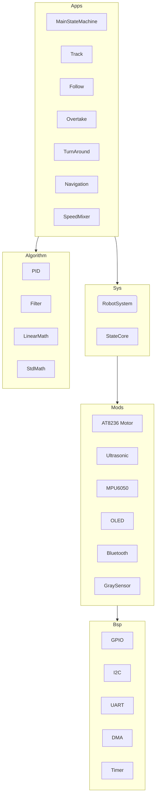
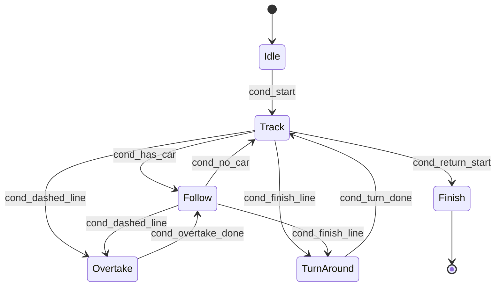

# <center>🚗 NJUST SmartCar 2026</center>

[](https://www.ti.com/product/MSPM0G3507)
[](https://www.freertos.org/)
[]()
[](LICENSE)

**2026 年“领景·利利普杯”南京理工大学大学生电子设计竞赛**  
**试题一：智能驾驶小车设计（A1 题第一阶段任务）**

一个基于 **TI MSPM0G3507** 与 **FreeRTOS** 的多任务智能小车系统，采用 **BSP → Mods → Sys → Apps** 四层软件架构，实现自主巡线、超声波跟车、虚线超车、终点掉头原路返回以及陀螺仪坐标导航。

> 佛祖保佑，永无 BUG 🙏

---

## 📸 功能演示

| 巡线 & 跟车 | 虚线超车 | 掉头返回 | 坐标导航 |
|:-----------:|:---------:|:---------:|:---------:|
| *(gif/video coming)* | *(gif/video)* | *(gif/video)* | *(gif/video)* |

---

## 🧠 系统架构



- **Bsp 层**：硬件抽象，封装 GPIO、I²C、UART、DMA、Timer 等外设驱动。  
- **Mods 层**：外设模块驱动（电机驱动、超声波、MPU6050、OLED、蓝牙、灰度传感器）。  
- **Sys 层**：系统级组件，包含全局 `RobotSystem`（任务调度、应用管理、OLED 显示）、`StateCore`（状态机引擎）、`Positioner`（定位，待扩展）。  
- **Apps 层**：应用控制逻辑，采用 `Application` 基类 + `StateCore` 组合，实现各行驶功能。  
- **Algorithm 层**：独立的算法工具箱，包括位置式/增量式 PID、前馈控制、多种滤波器、二维/三维向量运算、矩阵运算。

---

## ⚙️ 硬件列表

| 模块 | 型号 | 说明 |
|------|------|------|
| 主控 | MSPM0G3507 (Cortex-M0+ 80MHz) | TI LaunchPad |
| 电机 | JGB37-520 直流减速电机 (带霍尔编码器) | 减速比 1:30，12V |
| 电机驱动 | AT8236 | 支持 PWM 调速 ，双路驱动 |
| 超声波 | HC-SR04 (硬件捕获) | 高精度测距 |
| 陀螺仪 | MPU-6050 (软件 I²C) | 偏航角互补滤波 |
| 灰度传感器 | 八路数字灰度 | 巡线及虚线识别 |
| 蓝牙 | HC-05 | 与上位机通讯 |
| OLED | 0.96 寸 I²C | 显示距离、速度、参赛号 |
| 电源 | 12V 锂电池 + 5V 锂电池 | 强弱电隔离 |

---

## 🚦 行驶功能

| 功能 | 描述 |
|------|------|
| **巡线行驶** | 8 路灰度加权平均偏差 → PD 控制差速，沿黑线稳定前进 |
| **固定距离跟车** | 超声波中值+互补滤波，PID 调节速度，维持距前车 **20 cm** |
| **虚线超车** | 识别虚线段 → 加速 → 左变道 → 超越 → 右变道回原线 |
| **终点掉头返回** | 检测终点十字线 → 原地 180° 旋转 → 沿原路巡线返回起点 |
| **坐标导航** | 蓝牙接收目标坐标，陀螺仪航向修正 + 里程计平滑弧线导航 |

> 注：所有显示界面均标注参赛小组编号。

---

## 🌳 目录结构

```
NJUST_SmartCar_2026/
├── Algorithm/            # 算法库
│   ├── filter.cpp/hpp    # 滑动平均、中值、一阶互补滤波
│   ├── pid.cpp/hpp       # 位置/增量 PID + 前馈 + 死区
│   ├── std_math.cpp/hpp  # Vec2/Vec3 向量运算、限幅、转速换算
│   └── linear_math/      # 线性代数（矩阵运算）
├── Apps/                 # 应用层
│   ├── MainFrame.cpp/hpp           # 程序入口
│   ├── MainStateMachine.cpp/hpp    # 主状态机
│   ├── Track.cpp/hpp               # 巡线
│   ├── Follow.cpp/hpp              # 跟车
│   ├── Overtake.cpp/hpp            # 超车
│   ├── TurnAround.cpp/hpp          # 掉头
│   ├── Navigation.cpp/hpp          # 坐标导航
│   └── SpeedMixer.cpp/hpp          # 速度整合（多源冲突解决）
├── Sys/                  # 系统层
│   ├── System.cpp/hpp              # RobotSystem 全局单例
│   ├── StateCore.cpp/hpp           # 状态机引擎
│   ├── Positioner.cpp/hpp          # 定位器（预留）
│   ├── Chassis/                    # 底盘控制（预留）
│   └── SysDefs.hpp                 # 单例/App 重载宏
├── Mods/                 # 模块层
│   ├── bluetooth.cpp/hpp           # HC-05 蓝牙
│   ├── motor_at8236.cpp/hpp        # 电机驱动
│   ├── mpu6050.cpp/hpp             # MPU6050 陀螺仪
│   ├── oled.cpp/hpp                # OLED 显示
│   ├── std_sensor.cpp/hpp          # 灰度传感器
│   ├── ultrasonic.cpp/hpp          # 超声波（捕获/GPIO）
│   └── vofa/                       # VOFA+ 调试
├── Bsps/                 # 板级支持包
│   ├── bsp_system/                 # 系统时钟/DWT
│   ├── gpio/                       # GPIO 抽象
│   ├── iic/                        # 软/硬 I²C
│   └── uart/                       # UART + DMA
├── RtosCpp.cpp/hpp       # FreeRTOS 任务创建
├── main_freertos.c       # 启动代码
└── README.md
```

---

## 💻 软件开发环境

- **IDE**：Code Composer Studio (CCS)
- **编译器**：TI Arm Clang Compiler
- **RTOS**：FreeRTOS v202104.00
- **MSPM0 SDK**：ti_msp_dl_config
- **调试工具**：VOFA+ 串口示波器

---

## 🚀 快速开始

1. **克隆仓库**
   ```bash
   git clone https://github.com/yourname/NJUST_SmartCar_2026.git
   ```

2. **导入工程**
   在 CCS 中导入 `NJUST_SmartCar_2026` 工程，确保已安装 MSPM0 SDK。

3. **硬件连接**
   参照 `BSP` 中的引脚定义，连接电机驱动、传感器、OLED、蓝牙等。

4. **编译下载**
   编译并下载到 MSPM0G3507 开发板，复位后小车自动进入 Idle → Track 状态。

5. **参数调试**
   - 巡线 PID：`Track.cpp` 中 `track_pid.Init()` 参数
   - 跟车 PID：`Follow.cpp` 中 `follow_pid.Init()` 参数
   - 掉头时间：`TurnAround.hpp` 中 `ROTATE_TIME_MS`
   - 超车阶段时间：`Overtake.hpp` 中 `ACCEL_TIME` 等

---

## 🔧 状态机流程



所有条件均通过 `StateCore` 的 `LinkTo` 机制驱动，状态行为函数由 `MainStateMachine` 统一管理。

---

## 📝 关键设计

- **强弱电隔离**：电机驱动 12V 与控制电路 5V 通过双电池方案完全隔离，PCB 分区铺铜，单点共地。
- **ADC/DMA 采样**：灰度传感器使用 GPIO 中断采集，超声波使用硬件捕获定时器，避免 CPU 轮询。
- **多模态速度整合**：`SpeedMixer` 根据优先级仲裁各个 App 的速度命令，解决冲突（导航 > 超车 > 掉头 > 跟车 > 巡线）。
- **预分频可调**：每个 `Application` 可独立设置更新频率，节省 CPU 时间。
- **内存保护**：为每个 FreeRTOS 任务预分配栈空间，并启用栈溢出检测。

---

## 🐞 已知问题与 TODO

- [ ] 坐标导航里程计尚未接入编码器，目前使用时间和速度估算。
- [ ] 终点十字线检测需根据实际场地优化阈值。
- [ ] MPU6050 偏航角漂移需使用加速度计进行互补滤波（当前仅为积分）。
- [ ] 上位机串口屏尚未实现完整的实时数据显示。
- [ ] 蓝牙接收坐标指令的解析函数待完成。

---

## 🤝 贡献者

项目由 南京理工大学 自动化学院 A1NJ48队 开发，团队成员：  
- [zwj051029](https://github.com/zwj051029)
- [NovaZone1](https://github.com/NovaZone1)  
- [yekong6663](https://github.com/yekong6663) 

欢迎提交 Issue 和 Pull Request 改进本项目。

---

## 📄 许可证

本项目基于 [MIT License](LICENSE) 开源，第三方组件遵循其原始许可。

---

## 🙏 致谢

- 南京理工大学电子设计竞赛组委会提供赛题与元器件
- MSPM0 SDK 开发团队
- FreeRTOS 开源社区

---

**🌟 如果这个项目对你有帮助，请给一个 Star！**